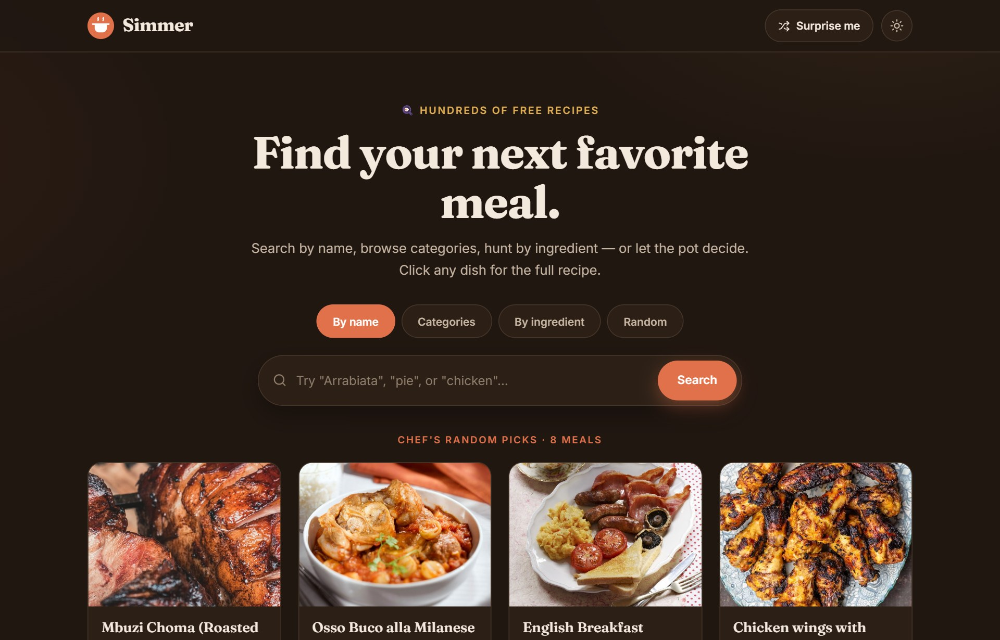
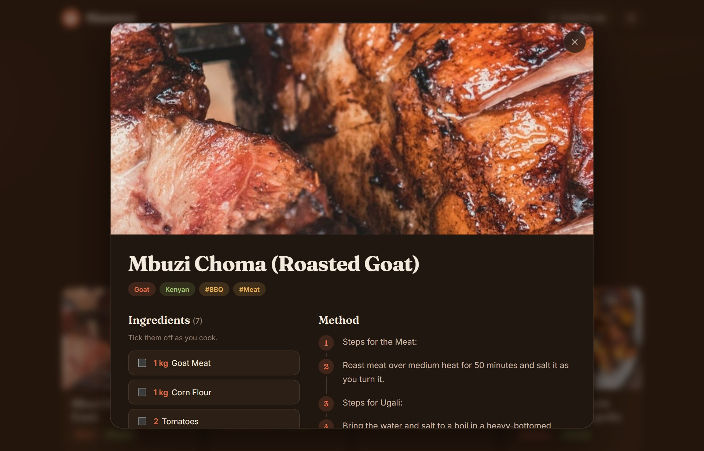

<div align="center">

# Simmer

**Find your next favorite meal.**

[](https://react.dev)
[](https://www.typescriptlang.org)
[](https://www.themealdb.com/api.php)

A live demo by [David Guijosa](https://www.zntsns.com) · part of the
[portfolio monorepo](https://github.com/Davidzent/ZNTSNS) · served at `/simmer/`

</div>

> **This repository is a read-only mirror.** Simmer is developed in the
> [ZNTSNS monorepo](https://github.com/Davidzent/ZNTSNS/tree/main/apps/simmer) and
> published here automatically on every change. It shares that workspace's ESLint
> and TypeScript configs and builds into its shared `dist/`, so it is not set up to
> install or build on its own — clone the monorepo to run it. Open issues and pull
> requests there.



Simmer is a standalone **recipe finder** with its own warm, editorial identity,
powered by the free [TheMealDB](https://www.themealdb.com/api.php) API. Search
hundreds of dishes, browse by category or ingredient, or let the pot decide.

---

## Features

- **Four ways to search** — by name, by category (browse the bubbles), by main
  ingredient (with an autocomplete of every ingredient), or **shuffle** random
  meals.
- **Full recipe view** — a photo header, tag chips, a **check-off ingredient
  list**, and numbered **method steps** (cleaned of TheMealDB's inconsistent
  `STEP 1` / `1.` prefixes), plus YouTube & source links.
- **Pagination** — 16 results per page with a tidy pager.
- **Light / dark theme** — warm cream by day, espresso by night; remembers your
  choice.
- **Loading & empty states**, keyboard-accessible modal, `prefers-reduced-motion`
  support.

<table>
  <tr>
    <td width="50%"><p align="center"><em>Search modes & random picks</em></p></td>
    <td width="50%"><p align="center"><em>Full recipe — ingredients & method</em></p></td>
  </tr>
</table>

---

## Tech

- React 19 + TypeScript (strict)
- A tiny typed [`api.ts`](api.ts) client wrapping TheMealDB endpoints
  (`search.php`, `filter.php`, `lookup.php`, `random.php`, `categories.php`,
  `list.php`)
- Hand-written CSS (`Fraunces` display serif + `Inter`), no UI framework

## Run it

It's part of the portfolio monorepo, so install once at the repo root and run it
from there:

```bash
pnpm install
```

```bash
pnpm --filter simmer dev
```

Then open <http://localhost:5174/simmer/> (override the port with `PORT`).

## Credits

Recipe data & photography from [TheMealDB](https://www.themealdb.com) (free
test API). Simmer is a portfolio demo and not affiliated with TheMealDB.
